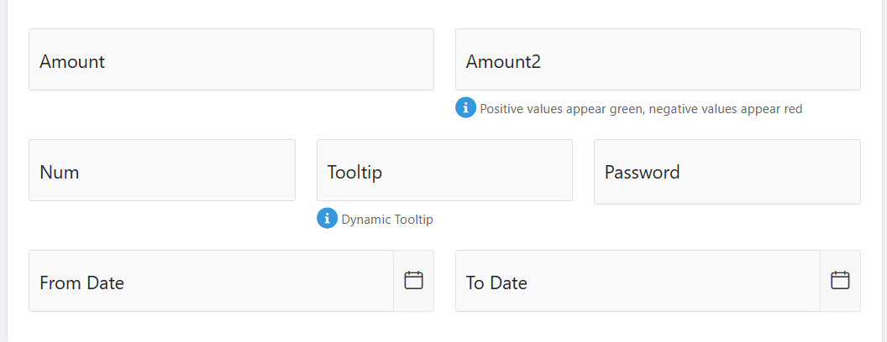

# Oracle-APEX-Advanced-Item-Features-Demo
This Oracle APEX demo application showcases several enhanced input field features using JavaScript and built-in APEX functionalities. The goal is to improve user experience, ensure accurate data entry, and apply interactive validations.

## Features & Steps
### 1. Password Strength Check
#### Validation Steps:

Enforce rules (e.g. minimum length, uppercase, digit, special char)

Provide real-time feedback (e.g. "Weak", "Strong")

JavaScript function hook or dynamic action to validate and mark the item.

### 2. Number Formatting (Thousands Separator)
#### Implementation Steps:

JavaScript listener on input/change

Automatically format typed numbers into groups of three digits

Remove separators on backend processing if needed

## 🧪 Technologies
* Oracle APEX (low-code platform)

* JavaScript

* HTML/CSS

## Use Case
* This project can be used as a reference for developers who want to:

* Enhance standard APEX item behavior

* Improve form validation UX

Implement custom logic for user input in APEX applications

